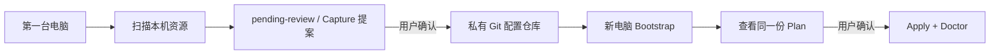
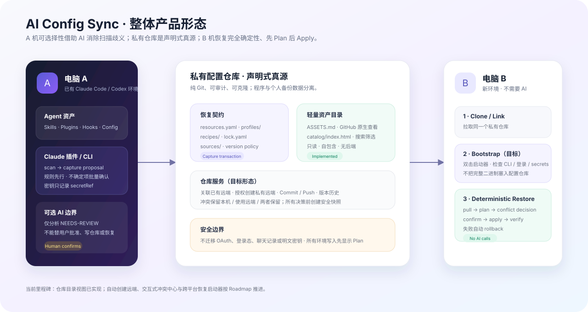
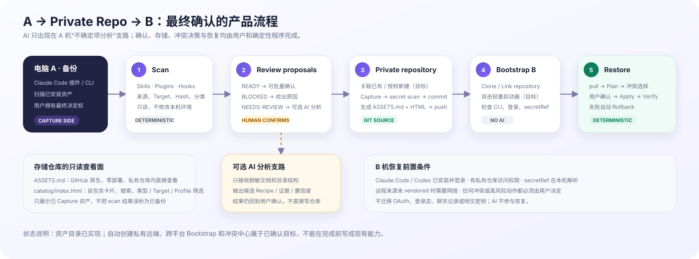
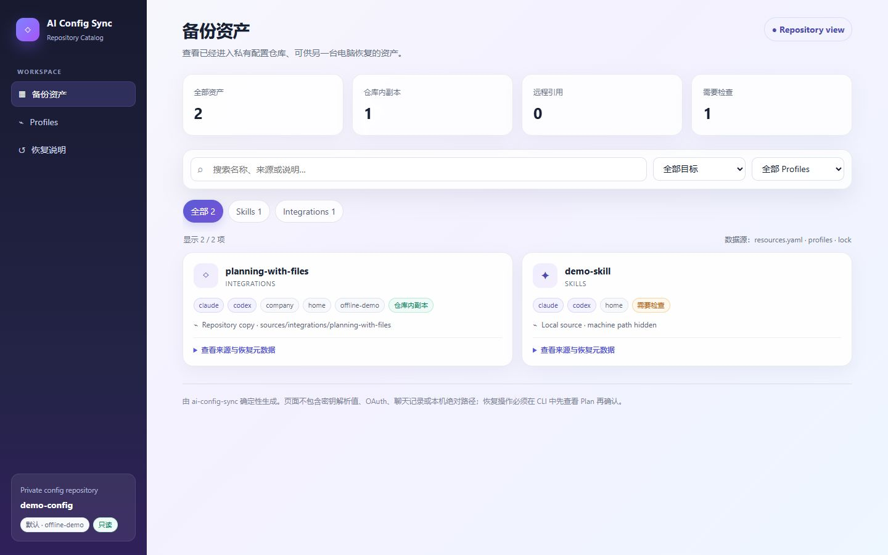

# AI Config Sync

[](https://github.com/Super-YYQ/ai-config-sync/actions/workflows/ci.yml)
[](https://www.npmjs.com/package/ai-config-sync)
[](https://nodejs.org/)
[](LICENSE)

在 **Claude Code / Codex** 中扫描、确认和备份 Skill、Plugin、Hook，并从私有 Git 仓库确定性恢复另一台电脑。

<p align="center">
  <strong>电脑 A：扫描与确认　→　私有配置仓库：可审计资产真源　→　电脑 B：无 AI 恢复</strong>
</p>

AI Config Sync 将“安装了什么、来自哪里、应该怎样恢复”保存到你自己的私有
Git 仓库。换电脑后，通过 CLI 或本地 Web 页面连接该仓库、检查恢复 Plan，
一次确认即可重建工作环境；第二台电脑不需要再次使用 AI 分析。

> [!IMPORTANT]
> 当前版本为 **v0.5.0 Public Beta**。仓库内的隔离 HOME 测试、跨平台 CI 和
> npm 包 Smoke 已覆盖核心流程，但真实已登录的 Claude Code / Codex 客户端
> 仍建议先在个人或测试环境验证。

## 目录

- [核心能力](#核心能力)
- [工作原理](#工作原理)
- [环境要求](#环境要求)
- [快速开始](#快速开始)
- [完整双机流程](#完整双机流程)
- [多机备份与冲突处理](#多机备份与冲突处理)
- [Skill 与 Plugin 如何处理](#skill-与-plugin-如何处理)
- [私有配置仓库](#私有配置仓库)
- [私有仓库资产目录](#私有仓库资产目录)
- [命令参考](#命令参考)
- [安全设计](#安全设计)
- [支持情况](#支持情况)
- [开发与贡献](#开发与贡献)

## 核心能力

- 扫描 Claude Code 与 Codex 的用户级 Skill、Plugin、Hook 和受管配置。
- 将本机发现转换为可审查的 Capture 提案，而不是直接上传整个配置目录。
- 记录来源仓库、锁定版本和安装配方；Marketplace Plugin 记录安装方式，
  不复制客户端缓存。
- 使用 Profile 区分 `home`、`company` 等设备或环境。
- 在恢复前生成 Plan，并校验配置仓、Recipe、Profile 与来源快照是否过期。
- Apply 失败时恢复文件快照，并尽量补偿本次外部安装操作。
- 提供 Claude Plugin、Codex Skill、独立 CLI、本地 Web 页面四种入口。
- 为私有仓库生成只读资产目录（`ASSETS.md` 与自包含 HTML 页面），并可自动
  部署为 GitHub Pages 在线查询页面。
- SessionStart 只做轻量扫描并生成 `pending-review`；默认不会自动 capture、
  commit 或 push。

## 工作原理

程序仓库和用户配置仓库相互独立：

| 仓库 | 保存内容 | 是否包含密钥 |
| --- | --- | --- |
| `Super-YYQ/ai-config-sync` | CLI、Plugin、驱动、Schema 与 Web UI | 否 |
| 你的私有配置仓库 | 资源清单、Profile、Recipe、来源锁与可选 vendored Skill | 不应包含 |



AI 只在第一台电脑遇到来源或布局不明确的资源时作为可选分析能力。确定后的
安装边界会写入 Recipe/Lock；新电脑按确定性配置恢复，不依赖 AI 工具或 Skill。

## 环境要求

- Node.js 18 或更高版本
- Git
- 一个用于保存个人配置的私有 Git 仓库
- Claude Code 和 Codex 均为可选目标；只使用其中一个也可以

## 整体产品形态

<p align="center">
  
</p>

- **电脑 A**：规则优先扫描；只有 `NEEDS-REVIEW` 可选择 AI 辅助分析，最终由用户确认。
- **私有仓库**：Resources、Profiles、Recipes、Lock 与 vendored Sources 是声明式真源；不存明文密钥、登录态或聊天记录。
- **仓库查看面**：`ASSETS.md` 零部署查看，HTML 提供卡片、搜索和筛选；Capture 会附带生成 `.github/workflows/ai-config-sync-pages.yml`，在 GitHub 仓库设置中把 Pages Source 选为 GitHub Actions 后，每次 push 自动把自包含的 `catalog/` 页面部署为可搜索的站点（仅发布 catalog，不暴露仓库其余内容）。
- **电脑 B**：安装前先显示 Plan，冲突和高风险动作由用户决定，恢复引擎不调用 AI。

完整目标、当前差距和验收标准见 [`docs/PRODUCT_VISION.md`](docs/PRODUCT_VISION.md)。

### A → B 备份与恢复流程

<p align="center">
  
</p>

图中标注“目标”的自动创建私有远端、跨平台双击启动器和资产级冲突中心尚未完成；当前恢复仍需先安装 CLI、关联仓库并显式执行 `plan` / `restore`。

---

## 快速开始

### 推荐：本地 Web 页面

无需先安装任何 Skill：

```bash
npx ai-config-sync ui
```

页面会在随机安全端口启动，并且只监听 `127.0.0.1`。输入私有仓库地址和
Profile，检查恢复 Plan 后点击一次确认。

全局安装后也可以使用独立入口：

```bash
npm install --global ai-config-sync
ai-config-sync-ui
```

Windows 源码目录或解压后的 npm 包中，可以直接双击
[`AI Config Sync.cmd`](./AI%20Config%20Sync.cmd)。启动器优先使用同目录 bundle，
其次使用 PATH 中的 CLI，最后才使用 `npx`。它是可双击的 `.cmd` 启动器，
不是免 Node.js 运行时的单文件 `.exe`。

### CLI Bootstrap

```bash
ai-config-sync bootstrap --repo git@github.com:you/my-ai-config.git --profile home
```

交互终端会显示 Plan 并询问一次。CI 或无人值守环境必须显式传入 `--yes`：

```bash
ai-config-sync bootstrap --repo git@github.com:you/my-ai-config.git --profile home --allow-risk medium --yes
```

CLI 与 Web 页面共用同一个 Bootstrap 模块。Apply 使用刚刚展示的同一份 Plan
对象，并在执行前重新验证快照。

## 完整双机流程

### 第一台电脑：发现与备份

#### 1. 安装 Claude Plugin（Claude Code 用户）

```text
/plugin marketplace add Super-YYQ/ai-config-sync
/plugin install ai-config-sync@ai-config-sync
```

新开 Claude Code 会话后，插件内置的 CLI 和 SessionStart Hook 即可使用：

```text
/ai-config-sync:scan
/ai-config-sync:status
/ai-config-sync:capture
/ai-config-sync:restore
```

插件的 SessionStart 直接使用随插件发布的 bundle，不会后台调用 `npx`。

#### 2. 安装 CLI（Codex 或独立使用）

```bash
npm install --global ai-config-sync
```

#### 3. 关联私有配置仓库

关联已有本机目录：

```bash
ai-config-sync setup --config-path ~/ai-config/my-ai-config --profile home
```

或者从远程私有仓库 Clone：

```bash
ai-config-sync setup --repo git@github.com:you/my-ai-config.git --profile home
```

Codex Hook 必须显式启用：

```bash
ai-config-sync setup --config-path ~/ai-config/my-ai-config --target codex --enable-codex-hook
```

Codex Hook 支持仍为实验性，客户端首次运行时可能要求信任。

#### 4. 扫描、审查并写入配置仓库

```bash
ai-config-sync scan
ai-config-sync capture --analyze
ai-config-sync capture --yes
```

需要提交或推送时必须显式选择：

```bash
ai-config-sync capture --yes --commit
ai-config-sync capture --yes --commit --push
```

`--analyze` 使用确定性启发式分析未知布局；`--ai` 是它的兼容别名。只有在
本地配置中明确设置 AI provider 时才会调用真实模型。

Capture 状态：

| 状态 | 含义 | `--yes` 是否写入 |
| --- | --- | --- |
| `READY` | 来源和配方已经解析 | 是 |
| `NEEDS-REVIEW` | 来源、边界或安装策略需要确认 | 否 |
| `BLOCKED` | 缺少必要来源、Marketplace 信息或违反安全策略 | 否 |
| `SYSTEM-EXCLUDED` | 系统内置或缓存资源 | 否 |

### 第二台电脑：确定性恢复

第二台电脑只需要 Node.js、Git 和私有仓库地址，不需要先安装 Claude/Codex
Skill，也不需要重新进行 AI 分析。

推荐入口：

```bash
npx ai-config-sync ui
```

也可以完全使用 CLI：

```bash
ai-config-sync bootstrap --repo git@github.com:you/my-ai-config.git --profile home
```

旧的分步命令仍然可用：

```bash
ai-config-sync setup --repo git@github.com:you/my-ai-config.git --profile home
ai-config-sync plan
ai-config-sync restore --yes --allow-risk medium
ai-config-sync doctor
```

## 多机备份与冲突处理

多台电脑可以先后向同一个私有配置仓备份。每台机器只 Capture 自己未纳管
的资产，仓库最终是所有机器的**并集**；恢复过的资产在本机是 managed 状态，
不会重复提案。冲突在两个层面分别处理：

**Git 层（先后推送撞车）**

- `capture --commit` 在写入前会自动 `git pull --ff-only`（工作区干净且配置了
  远端时），大多数"另一台机器刚 push 过"的情况会静默追上。
- push 前会先 fetch 刷新远端状态；本地与远端已经分叉时拒绝推送，并给出
  完整修复指引：`git pull --rebase` 后解决冲突再推送。带 `--push` 的
  capture 在已分叉时会在写入任何东西**之前**中止，避免产生更多分叉提交。
- rebase 时的文件冲突解法：`resources.yaml` 按 id 取两侧并集；
  `ASSETS.md` 和 `catalog/index.html` 任选一侧，然后用
  `ai-config-sync inventory --write` 重新生成即可。

**资产层（同一个 id、两台机器改出不同内容）**

- Capture 提案阶段会比较本机目录与仓库内 vendored 副本的内容哈希：不一致
  时该项被标为 `NEEDS-REVIEW`（`reason=same-id-different-content`），
  `--yes` 不会自动写入，由你决定保留哪一份（改用不同的资源 id 可两份都留）。
  内容一致则保持安静，不会产生噪音。
- 远程引用类资源（GitHub、Marketplace）没有本地副本可比，仍维持静默跳过。

## Skill 与 Plugin 如何处理

AI Config Sync 管理的是资源的安装与恢复信息，不要求外部 Skill 仓库遵循统一
发布边界。扫描后通常会落入以下类型：

| 类型 | Capture 行为 | 新电脑恢复行为 |
| --- | --- | --- |
| 本地自定义或复制改造的 Skill | 用户确认后 vendoring 到私有仓库 | 从私有仓库复制到目标 Skill 目录 |
| 能识别源仓库的 Skill | 记录仓库、锁定版本、子路径和 Recipe | 根据确定的 Recipe/Driver 安装；不明确时要求审查 |
| Claude Marketplace Plugin | 记录 Marketplace 与插件标识，不复制 cache | 执行 `marketplace add`、`install`、`enable` |
| 系统内置或工具自身资源 | 标记为系统资源并排除 | 不处理 |

一个仓库包含多个 Skill 时，资源身份由“仓库 + Skill 名称/子路径”共同确定，
不会因为共用一个仓库而把整个仓库都安装到 Skill 目录。

对于来源仓库中同时存在 Plugin、独立 Skill 安装命令或多种入口的情况，只有
证据充分且 Recipe 已确认的策略才会自动恢复；无法安全判断的资源保持
`NEEDS-REVIEW`，不会猜测执行仓库中的任意脚本。

`ai-config-sync` 和它安装的 `config-sync` 入口自身不会被 Capture，避免递归同步。

## 私有配置仓库

可以从 [`examples/private-config-template`](./examples/private-config-template)
复制最小模板。典型结构如下：

```text
my-ai-config/
├─ config.yaml
├─ resources.yaml
├─ lock.yaml
├─ profiles/
│  ├─ base.yaml
│  ├─ home.yaml
│  └─ company.yaml
├─ recipes/
├─ sources/
│  ├─ skills/
│  ├─ hooks/
│  ├─ claude-plugins/
│  └─ integrations/
└─ instructions/
   ├─ common/
   ├─ claude/
   └─ codex/
```

本机连接信息、状态、事务备份和待确认队列保存在 `~/.ai-config-sync/`，不提交
到配置仓库。`home`、`company` 等 Profile 支持多层 `extends`，并可针对资源
设置包含、排除和最大风险级别。

## 私有仓库资产目录

每个新建或已关联的私有配置仓库都可以生成两个只读视图：

- `ASSETS.md`：GitHub/GitLab 原生渲染的资产清单；
- `catalog/index.html`：不依赖后端或 CDN 的自包含页面，支持名称搜索与
  Kind、Target、Profile 筛选。

<p align="center">
  
</p>

```bash
# 只读查看，不写仓库
ai-config-sync inventory

# 为已关联仓库生成或刷新两个视图
ai-config-sync inventory --write

# 为已有配置仓库生成
ai-config-sync inventory --config-path /path/to/my-ai-config --write
```

Capture 提交后会自动刷新两个视图。同时会附带生成
`.github/workflows/ai-config-sync-pages.yml`：在 GitHub 仓库设置中把 Pages 的
Source 选为 **GitHub Actions** 后，每次 push 都会把自包含的 `catalog/` 页面
自动部署为可搜索的站点。该 workflow 只发布 `catalog/` 目录，不会暴露
Recipes、Profiles、Lock 或 vendored 源码，也绝不会覆盖你自己维护的同路径
workflow（删除或修改它均不影响 CLI 功能）。私有仓库的 Pages 需要 GitHub
付费计划，且站点仅对有仓库访问权限的人可见。

目录只展示**已经 Capture 进入仓库**的资产；尚未确认的 scan 结果不会被误标
为已备份。详细设计见 [`docs/ASSET_CATALOG.md`](docs/ASSET_CATALOG.md)。

## 命令参考

| 命令 | 用途 | 是否可能写入 |
| --- | --- | --- |
| `ui` | 启动本地 Bootstrap 页面 | 页面确认后会 |
| `bootstrap` | 连接仓库、显示 Plan、确认并恢复 | 确认后会 |
| `setup` | 初始化、关联、修复或重新配置 | 会 |
| `status` | 查看仓库、Profile、集成与待确认项 | 否 |
| `scan` | 扫描本机资源 | 默认否；`--write-pending` 写本地队列 |
| `capture` | 生成并应用 Capture 提案 | 需要 `--yes` |
| `inventory` | 查看或生成私有仓资产目录 | 默认否；`--write` 会 |
| `plan` | 显示恢复计划 | 否 |
| `apply` / `restore` | 按 Plan 恢复环境 | 需要 `--yes` |
| `update` | 更新锁定来源并重新应用 | 需要确认参数 |
| `doctor` | 检查依赖、仓库、Hook、Plugin 与密钥引用 | 否 |
| `drift` | 比较期望状态和本机状态 | 否 |
| `repair` | 修复缺失的受管集成 | 会 |
| `rollback --last` | 恢复最近一次文件备份 | 会 |
| `secret` | 检查或说明 `secretRef` 解析 | 否 |

查看完整参数：

```bash
ai-config-sync --help
ai-config-sync <command> --help
```

## 安全设计

### Plan 与 Apply

- 所有实际恢复写入都需要明确确认。
- Plan 快照配置仓 HEAD、未提交配置输入、完整 Profile 继承链、Recipe 内容哈希
  和锁定来源 commit。
- Apply 获取配置仓与 HOME 锁后重新验证快照；Plan 过期时拒绝执行。
- Web 与 CLI Bootstrap 在同一会话中传递已展示的 Plan，不会静默重建另一份。

### 事务与 Git

- Apply 在写入前备份文件和状态；硬失败时自动 rollback。
- Skill 目录使用临时目录和原子替换，避免留下半安装状态。
- Capture、Commit、Push 共用同一个配置仓锁。
- Capture commit 只暂存本次生成的路径；发现其他已暂存文件时拒绝提交。
- Git 来源 URL、ref 和缓存目录经过校验，离线恢复也验证最终 commit。

### 本地 Web 页面

- 仅绑定 `127.0.0.1`，不监听局域网地址。
- 随机生成只存在内存中的会话令牌，所有 API 都要求令牌。
- 校验 `Host` 与 `Origin`，使用严格 CSP，并限制请求体大小。
- 自动避开浏览器禁止访问的端口，默认空闲 15 分钟后关闭。
- 页面中的“关闭本地服务”会结束本次服务进程。

### 不同步的内容

- OAuth、登录 Cookie 与聊天记录
- 明文 API Key、私钥和真实 Secret
- Claude/Codex 内部缓存目录
- 系统内置 Skill

需要密钥的 Recipe 应保存 `secretRef`，在每台电脑上通过环境变量或本地 Secret
Provider 解析。安全问题请按照 [SECURITY.md](./SECURITY.md) 私下报告。

## 支持情况

| 能力 | Claude Code | Codex | 状态 |
| --- | --- | --- | --- |
| 用户级 Skill | 支持 | 支持，优先 `~/.agents/skills` | 可用 |
| Marketplace Plugin | 支持 | 不适用 | 可用 |
| SessionStart 待确认扫描 | 插件内置 Hook | `hooks.json` + `features.hooks` | Codex 实验性 |
| 私有仓 Capture / Restore | 支持 | 支持 | 可用 |
| 本地 Web Bootstrap | 支持 | 支持 | 可用 |
| Profile | 支持 | 支持 | 可用 |
| MCP 配置同步 | 未实现 | 未实现 | Roadmap |
| 项目级 Skill 完整流程 | 部分 | 部分 | Roadmap |
| 外部安装完整事务补偿 | 部分 | 部分 | 文件回滚已实现 |

已知限制：

- 真实登录状态下的 Claude Code / Codex 端到端测试尚未自动化。
- Codex Hook 的信任与事件行为可能因 CLI、App 或 IDE 版本而不同。
- 非标准多资源仓库可能需要 `capture --analyze` 或人工确认 Recipe。
- 外部 `claude plugin` 操作的补偿卸载仍是尽力而为。
- 自动 commit/push 不是默认后台行为；当前必须由用户显式触发。

详细计划见 [ROADMAP.md](./ROADMAP.md)，版本变化见
[CHANGELOG.md](./CHANGELOG.md)。

## 开发与贡献

### 从源码运行

```bash
git clone https://github.com/Super-YYQ/ai-config-sync.git
cd ai-config-sync
npm install
npm run build
node dist/ai-config-sync.cjs --version
```

### 验证命令

```bash
npm run typecheck
npm run test:unit
npm run test:integration
npm run test:coverage
npm run validate:plugin
npm run smoke:npm
```

`npm run build` 会同时生成 npm CLI bundle 与 Claude Plugin 内置 bundle。
`npm run smoke:npm` 会把 tarball 安装到隔离目录，验证发布包不依赖源码仓库。
空用户模板见 `examples/private-config-template/`，演示数据见 `examples/demo-config/`，
计划基线为 v0.5 Public Beta（见 `ROADMAP.md`）。

### 仓库结构

```text
packages/core/           Schema、路径、安全合并与 Secret
packages/scanner/        Claude/Codex 本机资源扫描
packages/state-manager/  状态、待确认队列、锁与事务备份
packages/git-sync/       配置仓与来源仓 Git 操作
packages/recipe-engine/  Plan/Apply、Capture、Doctor、Drift
packages/cli/            CLI、Setup、Bootstrap 与本地 Web
drivers/                 Skill、仓库布局、Marketplace 等驱动
integrations/            Claude Plugin 与 Codex 集成资产
examples/                私有仓模板和离线演示
tests/                   单元、集成与 E2E 测试
```

更多文档：

| 文档 | 内容 |
| --- | --- |
| [用户指南](./docs/USER_GUIDE.md) | 日常 Capture、恢复、Profile 与回滚 |
| [资产目录设计](./docs/ASSET_CATALOG.md) | ASSETS.md / HTML 视图与 Pages 部署 |
| [产品目标](./docs/PRODUCT_VISION.md) | 已确认的产品形态与验收标准 |
| [架构说明](./docs/architecture.md) | 模块边界、数据位置与事务模型 |
| [开发说明](./docs/development.md) | 构建、依赖方向和测试策略 |
| [贡献指南](./CONTRIBUTING.md) | Pull Request 与代码规范 |
| [发布说明](./docs/releasing.md) | 版本同步与 npm 发布流程 |
| [安全策略](./SECURITY.md) | 漏洞报告和数据边界 |

欢迎提交 Issue 或 Pull Request。贡献前请阅读
[CONTRIBUTING.md](./CONTRIBUTING.md)，并确保没有提交个人路径、私有仓库地址或
真实密钥。

## License

[MIT](./LICENSE) © Super-YYQ
